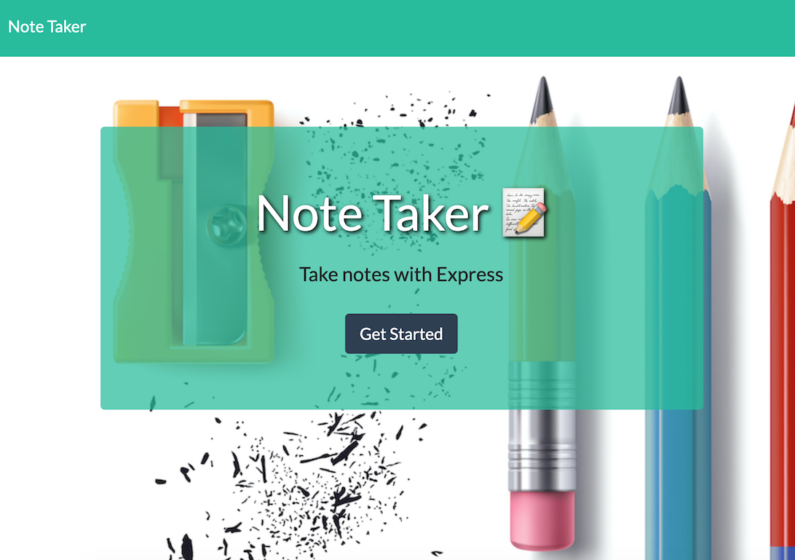

# Note.Taker

[](https://opensource.org/licenses/MIT)
      
     
## Description

An Express application used to write, save, and delete notes.

## Table of Contents
 
* [Installation](#installation)
* [Usage](#usage)
* [Credits](#credits)
* [License](#license)
 
## Installation
```
npm install
``` 

## Usage  

Access my website repository [here.](https://github.com/lee-amber-alex/Note.Taker)  
Visit my website [here.](https://salty-tundra-14714.herokuapp.com/) 

### Home Page 
   

### Notes Page 
    

## License
This project is covered under the MIT License.
 

## Tests
```
npm test
``` 
## Credits

Background images obtained from [freepik](http://www.freepik.com) 

## Questions
- [Email](lee.amber.alex@gmail.com)
- [Github Page](https://github.com/lee-amber-alex)
 
